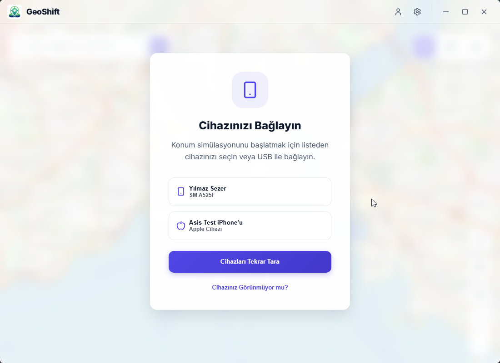
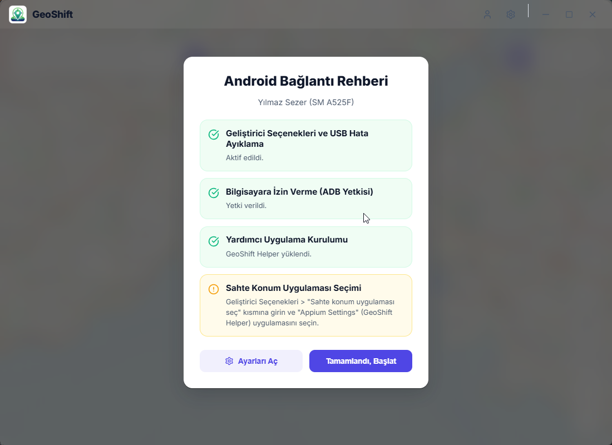
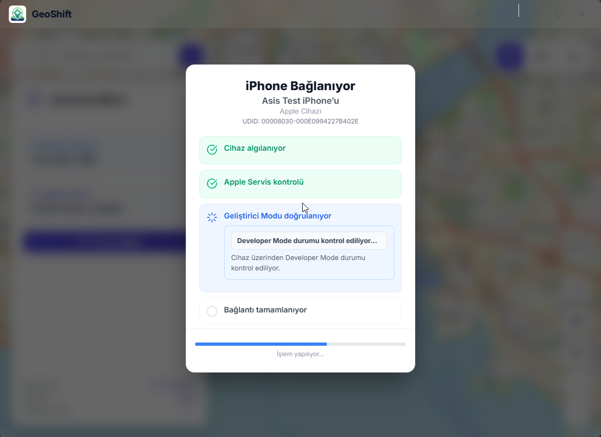
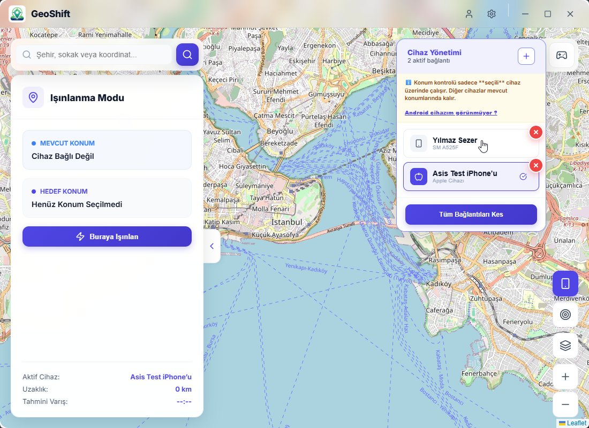
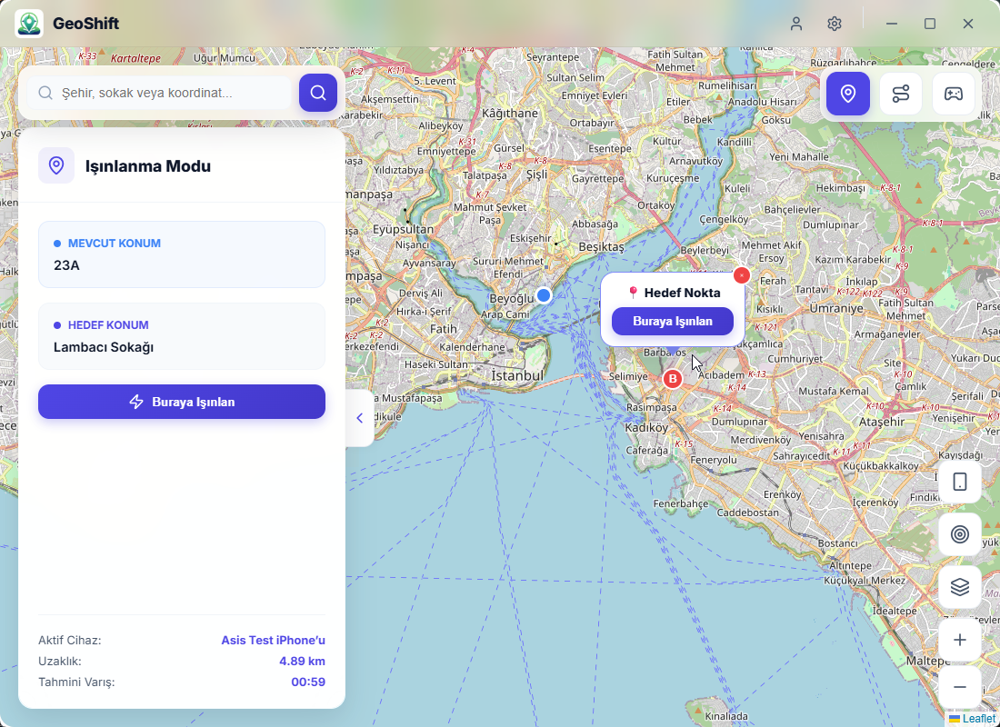
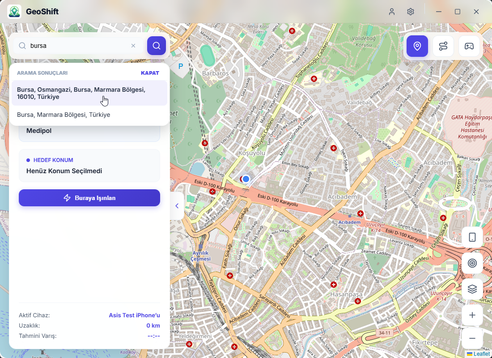

# 📱 GeoShift - iOS & Android Konum Değiştirme

<p align="center">
  
  <br>
  <b>Fiziksel cihazlarınızın GPS konumunu masaüstünden anlık olarak değiştirin.</b>
</p>

---

GeoShift, iMyFone AnyTo ve Tenorshare iAnyGo benzeri, hem **iOS** hem de **Android** cihazlar için geliştirilmiş modern ve yüksek performanslı bir GPS konum simülasyon uygulamasıdır.

## 📸 Uygulama Ekran Görüntüleri

<p align="center">
  
  
</p>

<p align="center">
  
  
</p>

<p align="center">
  
  
</p>

## ✨ Öne Çıkan Özellikler

- 🌍 **Evrensel Destek:** iOS 17+ (Tünel modu dahil) ve tüm Android sürümleriyle tam uyumlu.
- 🗺️ **İnteraktif Harita:** Leaflet tabanlı akıcı harita üzerinden nokta atışı konum seçimi.
- 🚀 **Anında Işınlanma:** Tek tıkla dünyanın herhangi bir noktasına fiziksel konum gönderimi.
- 🔌 **Otomatik Kurulum:** Android için gerekli yardımcı servisleri (Appium Settings) tek tıkla otomatik kurar.
- 🛠️ **Akıllı Teşhis:** Cihaz bağlantı sorunlarını, yetki eksikliklerini ve geliştirici modu durumlarını anında tespit eder.
- 🎨 **Modern Arayüz:** Glassmorphism tasarımı, karanlık mod desteği ve pürüzsüz animasyonlar.

## 🚀 Hızlı Başlangıç

### Gereksinimler

1. **Node.js** (v18+)
2. **Rust & Cargo** (Tauri için)
3. **ADB** (Android için PATH'e ekli olmalı)
4. **iTunes** (iOS sürücüleri için Windows'ta yüklü olmalı)

### Kurulum

```bash
# Projeyi klonlayın
git clone https://github.com/yilmazsezer55/geoshift.git
cd geoshift

# Bağımlılıkları yükle
npm install

# Geliştirme modunda başlat
npm run tauri dev
```

## 📖 Cihaz Hazırlığı

### Android
- **Geliştirici Seçeneklerini** açın.
- **USB Hata Ayıklama** modunu aktifleştirin.
- Uygulama içindeki rehberi takip ederek **Sahte Konum Uygulaması** olarak "Appium Settings"i seçin.

### iOS
- Cihazı bilgisayara bağlayın ve "Güven" seçeneğini onaylayın.
- **Geliştirici Modunu** aktifleştirin (Ayarlar > Gizlilik ve Güvenlik).
- iOS 17+ cihazlar için sistem otomatik olarak Remote Service Discovery tünelini kuracaktır.

## 🛠️ Teknik Altyapı

- **Frontend:** React, TypeScript, Vite
- **Backend:** Rust, Tauri
- **iOS Engine:** pymobiledevice3 (Python üzerinden tünelleme)
- **Android Engine:** ADB, Appium Settings Service
- **Harita:** Leaflet.js

## ⚠️ Önemli Not
Bu yazılım sadece **yazılım test ve geliştirme** amaçları için tasarlanmıştır. Konum tabanlı oyunlarda veya diğer platformlarda kullanım politikalarına aykırı durumlar oluşabilir. Sorumluluk kullanıcıya aittir.

---
**Geliştirici:** [Yılmaz Sezer](https://github.com/yilmazsezer55)  
**Lisans:** MIT
